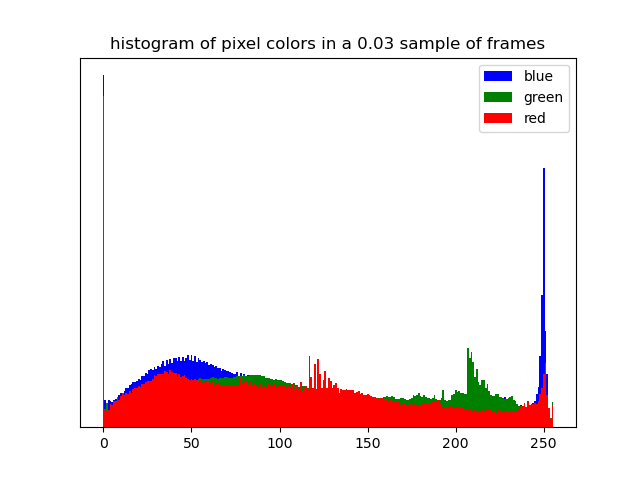

# chromalyze
I wanted to be able to quantify how blue is this movie. So I made a tool to
calculate the average red, green, and blue values for a sampling of frames in a
video and plot the result as a histogram. Here's an example.

```bash
chromalyzec>nix develop
chromalyzec>curl -LO https://download.blender.org/peach/bigbuckbunny_movies/big_buck_bunny_720p_stereo.avi
chromalyze>python -m chromalyze big_buck_bunny_720p_stereo.avi
14333.333333333416frames [00:32, 445.00frames/s]
```

The above will produce a histogram like this at `hist.png`


